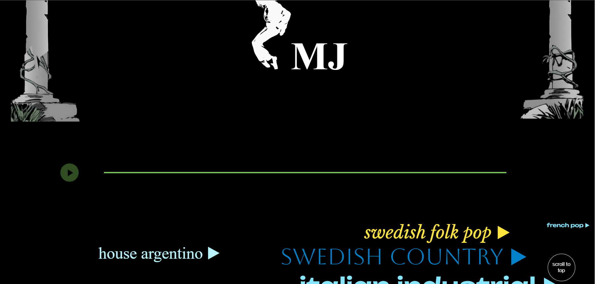
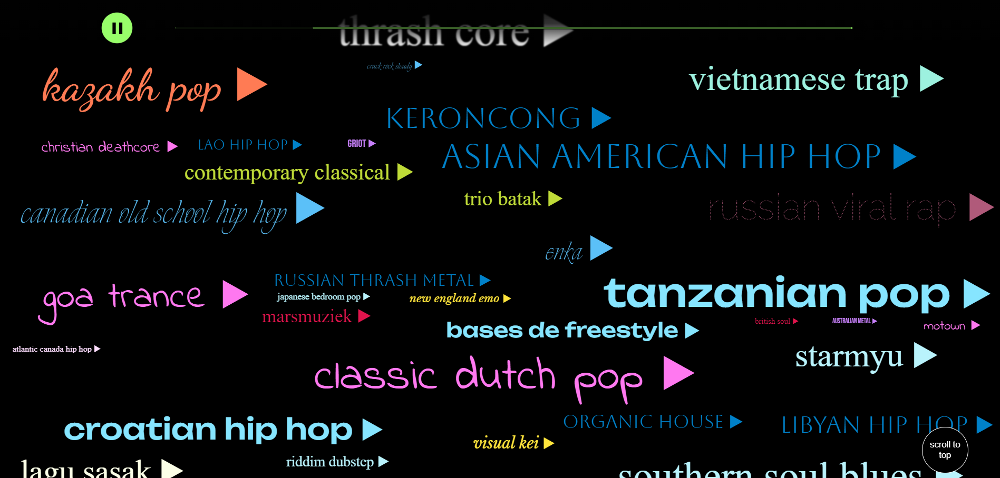

## Genrefy 

*Genrefy is a web application that brings a unique music discovery experience to users. Inspired by 'everynoise.com,' we've created a platform with over 5000 song categories. Our sleek and user-friendly interface, crafted from scratch using HTML, CSS, and JavaScript, provides an immersive exploration of diverse music genres. What sets Genrefy apart is the ability to click on any song, instantly playing it directly in the web browser. We've also added eye-catching CSS transitions to enhance the overall aesthetic. Dive into the world of music with Genrefy and uncover a vast array of tunes across genres in a seamless and enjoyable manner.*
 
Frontend :- developed a modern landing page UI using vanilla CSS and JavaScript and added logic to dynamically render songs randomly , everytime the user refreshes the site.  
Backend :- There was no open source API available for this so i had to manually scrape the data using Axios and Cheerio Library, then converted the scraped data to JSON format and fetched it on the client side. 

**Website Screenshots :**

**Setup :**
- clone the repository into your system.
- First install the required dependencies by the following command *npm install* then Start the server by *cd backend* and open terminal and run the index.js file.
- Open index.html file in frontend for the frontend part.
- Have fun. <picture>
  <source srcset="https://fonts.gstatic.com/s/e/notoemoji/latest/1f31f/512.webp" type="image/webp">
  
</picture>
